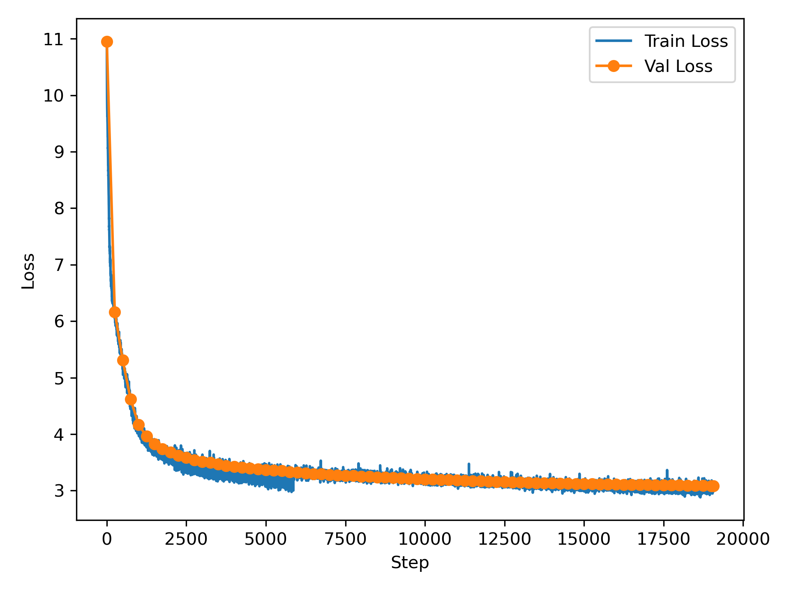
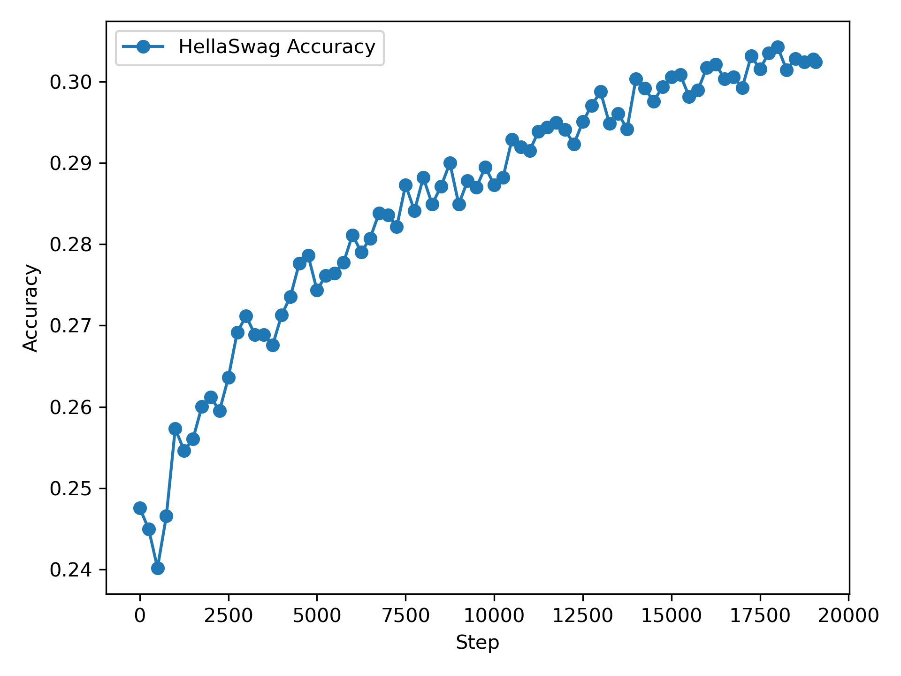

# GPT-2 (124M) From Scratch with PyTorch

A from-scratch implementation and training of a **GPT-2** style 124M parameter language model, built to demonstrate deep understanding of transformer internals, large-scale training mechanics, and distributed systems.

This project intentionally avoids high-level training frameworks to keep all model, optimization, and scaling decisions explicit and inspectable.

---

## What This Demonstrates

- End-to-end Transformer implementation (attention → optimizer → training loop)
- Distributed training with PyTorch DDP (SLURM-aware)
- Evaluation beyond loss (zero-shot HellaSwag)
- Production-style logging and checkpointing

---

## Model

- Layers : 12
- Heads : 12 
- Hidden size : 768
- Context length : 1024
- Vocab size : 50,304
- Parameters : ~124M
- Weight tying (token embeddings ↔ LM head)
- Flash Attention (scaled_dot_product_attention)
- Pre-LayerNorm blocks

---

## Training Setup

- **Dataset**: edu_fineweb10B (pre-tokenized shards)
- **Optimizer**: AdamW (fused when available)
- **LR schedule**: linear warmup → cosine decay
- **Precision**: bf16 autocast
- **Gradient accumulation** for large effective batch size
- **Gradient clipping** for stability
- **Hardware**: 2× NVIDIA A100 GPUs with PyTorch Distributed Data Parallel
- **Effective batch size**: 220k+ tokens / step  
- **Total steps**: 19,073

---

## Results

### Training & Validation Loss


### Zero-Shot HellaSwag Accuracy


---

## Engineering Highlights

- Custom shard-based dataloader with rank-synchronous transitions
- Deterministic multi-GPU training
- CSV-based metric logging for offline analysis
- Periodic validation + checkpointing
- Minimal abstractions, maximum transparency

---

## Running

```bash
# single GPU
python main.py

# multi-GPU (SLURM)
srun python main.py